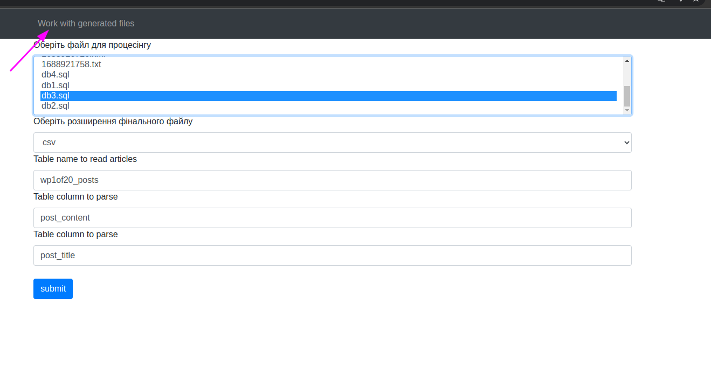
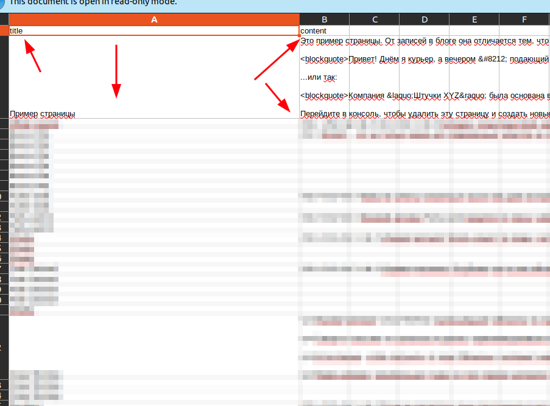
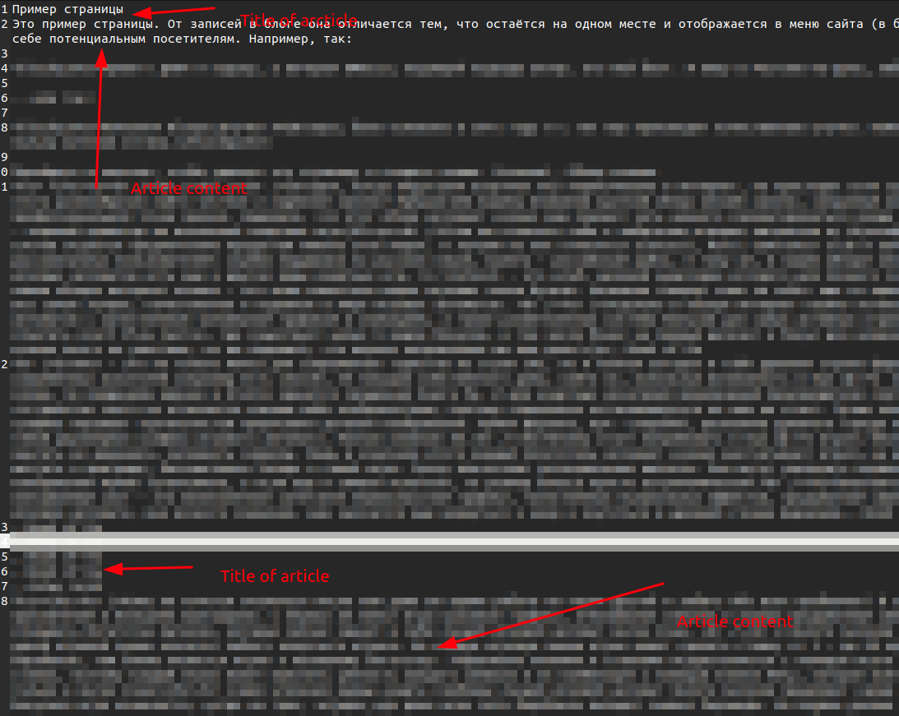

# Softum test task

### Tech stack
Docker
php8.0
mysql

##### How to run
**Docker ready project**
all variables for docker come from dot env file - so just run make build and you create
a new instance

setup all vars in ENV like in example file

##### Main description
Use route http://localhost/list/data/bases
To iterate

This project scan sql files and extract data via placed all data in tmp DB.
Also, this project generate files from selected tables and columns

##### Original description
Створити парсер контенту з баз даних + веб-інтерфейс для керування парсером.

Отримати маємо у вигляді посиланнь на скачування в інтерфейсі.
Кожна стаття має складатись з назви та тексту.
Має бути функціональна можливість обʼєднати кілька результуючих файлів в один.
Зі статтей потрібно прибрати будь які посилання та зображення,
при цьому потрібно зберегти початкове форматування.

